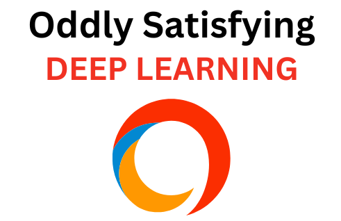

# Introduction

We all know that Deep learning is a subset of machine learning, which is essentially a neural network with three or more layers. Deep learning currently provide the best solutions to many problems in image recognition, speech recognition, and natural language processing (NLP's).

Through this book we intend to give you an oddly satisfying simplified concepts related to deep learning by not only teaching the theoretical aspects of the same but also making our hands dirty by developing code (both from scratch and by using available well known python libraries) for many state of the art practical applications of deep learning in a step by step fashion.

The conceptual part will advance from simple explainations to (maybe seemingly complex) mathematics, but hey don't worry, we will even, at some places, break down the complex maths into fun and interesting visuals to help you understand better.

So, in this book, we will teach most concepts just in time and it will be available online for **free**! The only thing we demand from you is a little bit of familiarity with functions and classes in Python, knowledge of basic calculus and linear algebra, followed by some understanding of probability (maximum likelihood and Bayes’ Rule) and mostly your undistracted attention :)

You can raise any queries [here](https://github.com/pythonandml/dlbook/issues).

